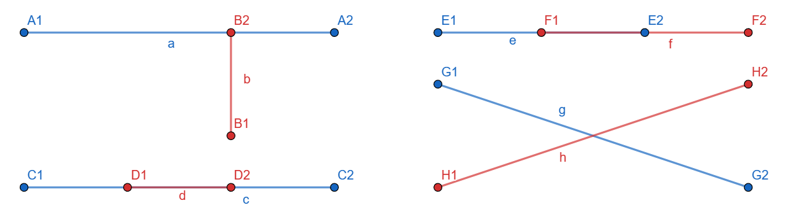

# Computational Geometry

## Praktikum 1

**Titel:** Bestimmung der Anzahl der sich schneidenden Strecken inklusive Zeitmessung.  
**Gruppe:** Johannes Walter, Luca Biege  
**Datum:** 05.04.2024  


# Einleitung

Im folgenden Praktikumsversuch geht es darum, einen Code zu entwickeln, welcher die Anzahl von Schnittstellen vieler Strecken berechnet und diese ausgibt. Die Strecken sind durch ein Punktpaar mit den Koordinaten [x1, y1, x2, x2] definiert und in einer *.dat* Datei gespeichert. Hierbei entpricht jede Zeile einer Strecke mit dem Startpunkt *P1* und dem Endpunkt *P2*. Die drei Dateien beinhalten 1000, 10.000 und 100.000 Strecken.  
Dabei soll die Dauer für die Ausführung des Programms gemessen und verglichen werden.  
Als Programmiersprache wird *Rust* verwendet.

# Grundlagen

**Strecken** unterscheiden sich von Geraden darin, dass sie einen klaren Start- und Endpunkt besitzen und damit eine endliche Länge haben. Eine Form zur Darstellung von Strecken mit dem Startpunkt P1 und dem Endpunkt P2 ist:
$$ \vec{x} = \overrightarrow{P1} + t \cdot \vec{d} \ \ \ \ \ | \ t \in \mathbb{R} \text{ mit } 0 \leq t \leq 1 \ | $$
$$ \text{mit} \ \ \ \ \ \vec{d} = \overrightarrow{P1P2} = \overrightarrow{P2} - \overrightarrow{P1} $$

Zwei Strecken haben einen gemeinsamen **Schnittpunkt**, wenn sie mindestens einen gemeinsamen Punkt beinhalten. Das gilt auch, wenn exakt der Endpunkt einer Strecke auf der anderen Strecke liegt (wie ein "T"), oder wenn die beiden Strecken auf derselben Geraden liegen und sich dabei berühren (teilweise oder komplett die eine Strecke innerhalb der anderen liegt). Die Abbildung zeigt exemplarisch Möglichkeiten für Streckenpaare mit (mindestens) einem Schnittpunkt:



Die **Determinante** einer 2x2 Matrix gibt eine Aussage über die Abhängigkeit der Vektoren einer Matrix. In diesem Fall wird sie verwendet um zu prüfen, wie zwei (Richtungs-) Vektoren zueinander stehen. Ist das Ergebnis der Berechnung $ det(A) = 0 $, so bedeutet dies, dass die Vektoren in dieselbe Richtung zeigen.

$$ det(A) = \begin{bmatrix}
a & b \\
c & d \\ 
\end{bmatrix}
 = a \cdot d - c \cdot b
$$

Das **Kreuzprodukt** zweier Vektoren ist ein Normalenvektor, also ein Vektor, welcher senkrecht auf diesen beiden Vektoren steht. Die Länge des Vektors gibt eine Aussage über die durch die beiden Vektoren aufgespannte Fläche. Sind die Vektoren parallel zueinander, spannen sie keine Fläche auf, d.h. das Kreuzprodukt $ \vec{a} \times \vec{b} = 0 $. Das Kreuzprodukt zweier 2-dimensionaler Vektoren lässt sich folgendermaßen berechnen:

$$ \vec{a} \times \vec{b} = \begin{bmatrix} a1 \\ a2 \\ \end{bmatrix} \times \begin{bmatrix} b1 \\ b2 \\ \end{bmatrix} = a1 \cdot b2 - a2 \cdot b1
$$
 

# Ausführung

Zur besseren Übersicht sind die Koordinaten zeilenweise aus der Datei ausgelesen und einem (n x 4)-Vektor `points` als float-Werte gespeichert. Fehlerhafte Zeilen werden dabei übersprungen und vermerkt.  
Anschließend wird in einer verschachtelten for-Schleife jede Zeile von `points` ausgelesen und die Koordianten als `Point` P1 und P2, bzw. für die zweite Strecke als P3 und P4 gespeichert. Aus ihnen lassen sich die Richtungsvektoren D12 und D34 berechnen.
```rust
struct Point {
    x: f64,
    y: f64,
}
```
Im folgenden Abschnitt werden zwei gefundene Lösungsansätze für die weitere Berechnung erläutert und analysiert.

## Ansatz geometrisch über Dreisatz

[Johannes Ansatz]


## Ansatz über Determinante

[Luca Ansatz]


# Test mit GeoGebra

[]


# Auswertung

[]

