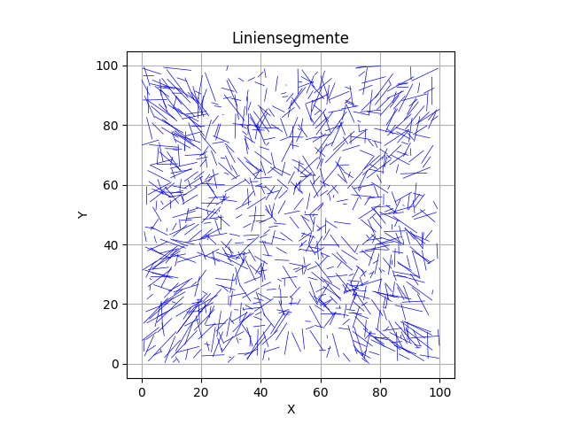
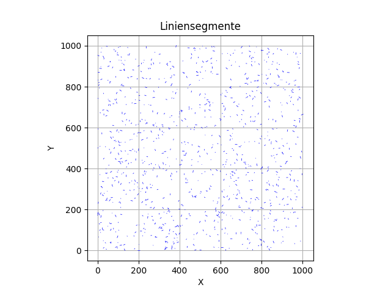
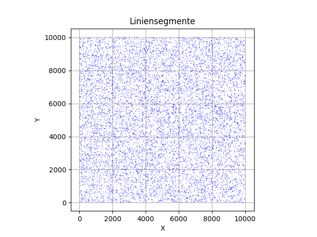
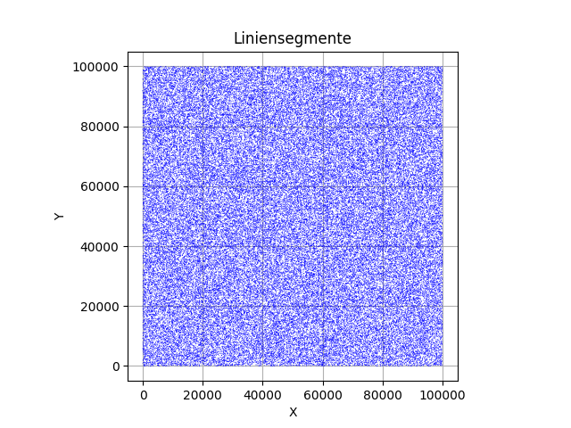

# Praktikum 3

## Aufgabenstellung
Implementieren Sie unter Zuhilfenahme der Funktionalität aus Aufgabe 1 zur Berechnung von Schnittpunkten zwischen Linien einen Sweep Line Algorithmus und vergleichen Sie die erzielten Laufzeiten. Verwenden Sie für die Laufzeitvergleiche neben den Daten aus der ersten Aufgabe die Daten aus s_1000_10.dat. Vergleichen Sie ebenso die Laufzeiten für die Files s_1000_1.dat und s_1000_10.dat (s.u.).

## Implementierung
- Programmiersprache: Rust (rustc 1.73.0 (cc66ad468 2023-10-03))

## Design

## Datenstrukturen
BTreeSet ist eine geordnete Struktur, welches effiziente Einfügen, Löschen und Suchen mit O(log n) bietet. Duplikate werden ausgeschlossen.

- SweepLine: BTreeSet<SortableLine>
- Events: BTreeSet<Event>

## Sortierung
Folgende Traits müssen für ein struct implementiert werden:
- Sortierung und Vergleichbarkeit von Elementen
  - Eq
  - PartialEq
  - Ord
  - PartialOrd
- Vergleich von Elementen auf Gleichheit (Duplikate)
  - PartialEq
  - Eq
- Reihenfolge der Elemente (relative und totale Ordnung)
  - PartialOrd
  - Ord
  - cmp

Die SweepLine umfasst Elemente vom Typ 'SortableLine'. Diese enthält das Attribut 'index', welches zum Sortieren verwendet wird.  
Events verwaltet die Events, welche nach Eventpunkt sortiert werden.

## Algorithmus (Pseudo Code)

1. Übersetze alle Segmente in Start- und Endevents
2. current_event = Nächstes Event
3. Update alle Elemente in der Sweepline, sodass der Index auf das Ergebnis der y-Funktion des Segments beim Eventpunkt (x) gesetzt wird
4. Abhängig vom EventTyp
   1. Start
      1. Füge Segment der SweepLine hinzu
      2. (below, above) = Nachbarn von Segment in SweepLine
      3. Schnitt Segment X below? Ja -> Neues IntersectionEvent in Events einfügen
      4. Schnitt Segment X above? Ja -> Neues IntersectionEvent in Events einfügen
   2. End
      1. (below, above) = Nachbarn von Segment in SweepLine
      2. Schnitt below X above? Ja -> Neues IntersectionEvent in Events einfügen
      3. Segment aus SweepLine entfernen
   3. Intersection
      1. Swap der sich schneidenen Linien in der SweepLine
         1. Swap durch Update der Startpunkte der Segmente mit y(Schnittpunkt + Delta)
         2. (lower, higher) = Segmente abhängig von Position in SweepLine
         3. below = Nachbarn vom lower Element in der SweepLine
         4. above = Nachbar vom higher Element in der SweepLine
      2. Schnitt lower X below? Ja -> Neues IntersectionEvent in Events einfügen
      3. Schnitt higher X above? Ja -> Neues IntersectionEvent in Events einfügen

Anmerkungen:
- Die Sortierung der SweepLine abhängig vom Startpunkt der Segmente zu machen, hat sich als problematisch herausgestellt. Die Startpunkte (X/Y) würden immer abhängig vom Eventpunkt neugesetzt werden. Ein direkter Vergleich ergab, dass die Koordianten, die Reihenfolge und Schnittpunkte andere sind, als durch die Verwendung eines dedizierten Index-Attributs. Eine Neuimplementierung mit Index lieferte bessere Ergebnisse und wurde in die finale Version eingefügt.
- Beim Swap wird auf das X des Schnittpunkts ein Delta addiert: let delta = 1e-9; Dadurch wird sichergestellt, dass die Y-Position der sich schneidenen Linien so unterschiedlich sind, dass die Linien 'geswapt' sind.

### Swap (Pseudo Code)
Tauscht zwei Linien in der SweepLine und findet deren neue Nachbarn.

1. Swap erhält line1, line2 und einen Schnittpunkt
2. (l1, l2) = Finde SweepLine Eintrag by line
3. Entfernung von l1 und l2 aus Sweepline
4. Update des Index von l1 und l2 auf x des Schnittpunkts + Delta
5. Insert von (l1, l2)
6. Bestimmung von (lower, higher): Die Position der Linien in der SweepLine
7. below = Nachbar von lower
8. above = Nachbar von higher
9. Rückgabe von below, lower, higher, above

## Auswertung
Die Aufgabenstellung erfordert einen Vergleich der Laufzeiten von BruteForce und SweepLine. Dazu liegen mehrere Testfiles vor:
- s_1000_10.dat
- s_1000_1.dat
- s_10000_1.dat
- s_100000_1.dat

Alle Testfiles außer s_1000_10.dat enthalten Daten, welche nicht den Voraussetzungen des SweepLine-Algorithmus entsprechen. Es wurden insgesamt drei verschiedene vergleichbare Dateien erstellt. Die Tabelle enthält die Anzahl der Segmente und Schnittpunkte pro Datei und die BruteForce- und SweepLine-Zeit. Gerundet auf zwei Nachkommastellen.

| Dateiname   | Anzahl Segmente | Anzahl Schnittpunkte | BruteForce | SweepLine |
|-------------|------------------|----------------------|------------|-----------|
| s_1000_10.dat     | 994             | 796                | 2.55 ms        | 11.74 ms
| jw_1000_10.dat    | 1.000            | 7                  | 2.38 ms        | 867.50 µs
| jw_10000_10.dat   | 10.000             | 193                | 241.72 ms      | 24.85 ms
| jw_100000_10.dat  | 100.000             | 69                 | 24.96 s     | 153.13 ms

## Visualisierung
Es wurde eine einfache Visualisierung mit Python entwickelt. Zur Veranschaulichung sind hier alle Testfiles geplottet:

### s_1000_10.dat

   

### jw_1000_10.dat

   

### jw_10000_10.dat

   

### jw_10000_10.dat

   

