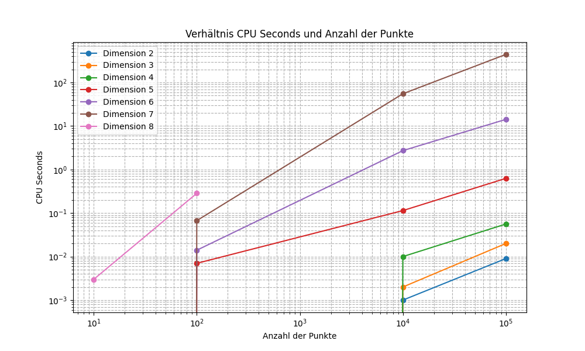
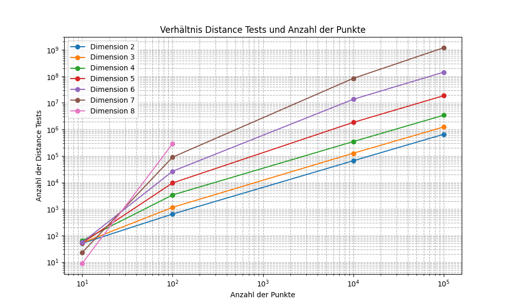
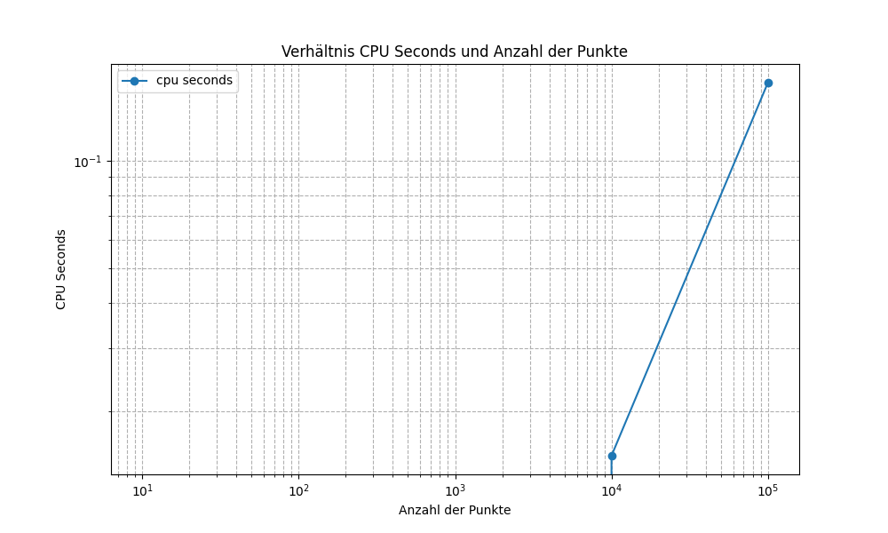
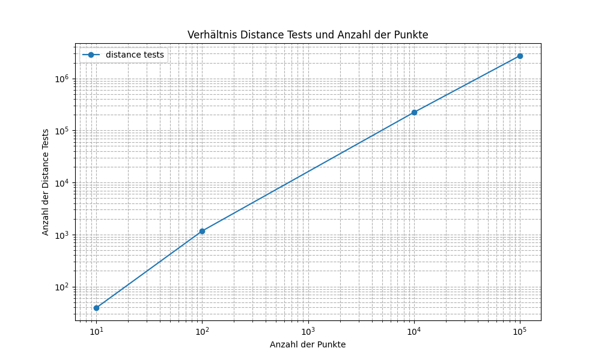
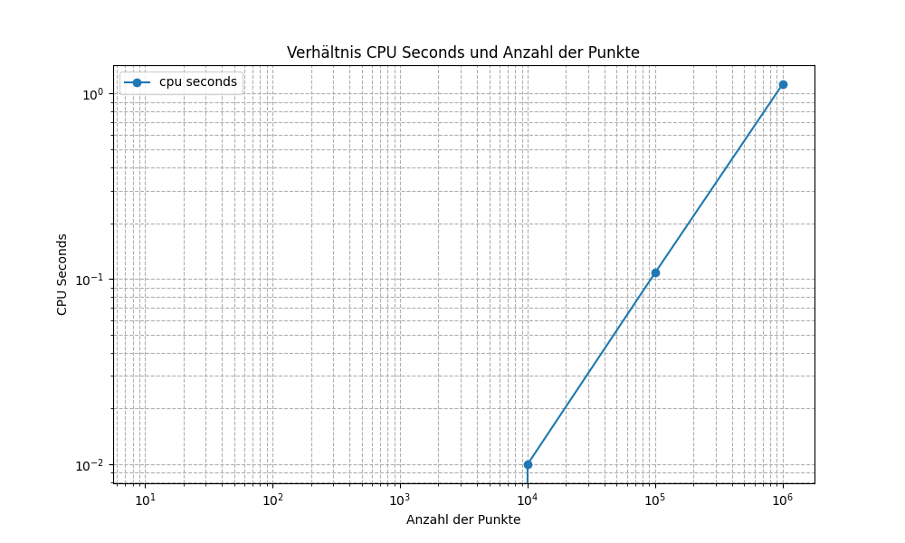
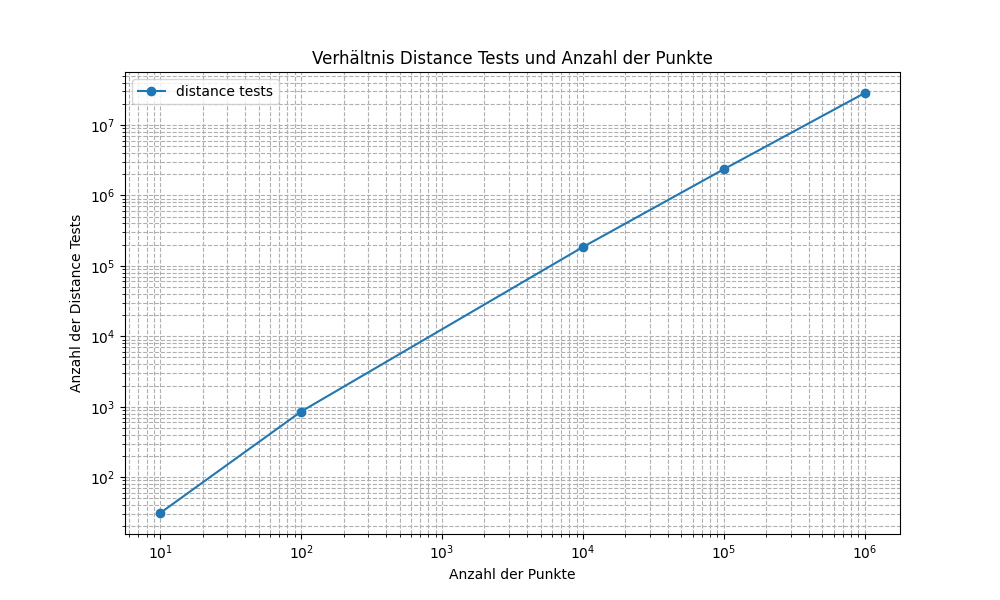
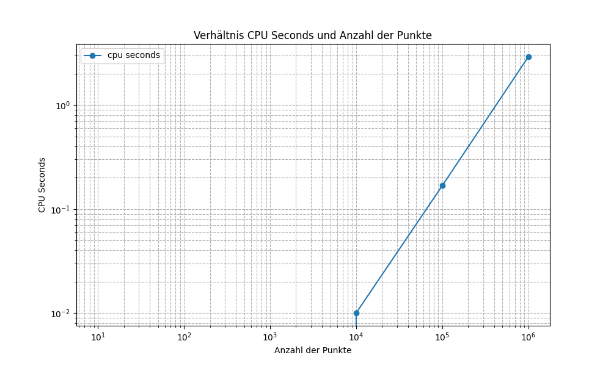

# Praktikum 4

## Aufgabenstellung
Installieren Sie das Programm qhull, erzeugen Sie zufällige Punktemengen und berechnen Sie mit qhull konvexe Hüllen, auch in höheren Dimensionen (qhull bringt ein Werkzeug zur Erzeugung von Punktmengen mit). Plotten Sie die Zeiten für zunehmende Punktanzahlen bei unterschiedlichen Dimensionen (2-8). Versuchen Sie, die Ausgaben von qhull bei "geschwätzigster" Einstellung nachzuvollziehen, zu verstehen und ggf. mit Inhalten dieser Lehrveranstaltung in Einklang zu bringen.

## Verwendete Software
- [Qhull](http://www.qhull.org/)
- [rbox](http://www.qhull.org/html/rbox.htm)
- [qconvex](http://www.qhull.org/html/qconvex.htm)

## Generierte Punkte
Qhull liefert mit rBox die Möglichkeit mit verschiedenen Optionen Punkte generieren zu lassen. Es wurden zufällige Punkte in folgenden Formen:

1. 3D Würfel
2. Reguläre 3-D-Spirale
3. Reguläres Polygon
4. 2-D-Sphäre

## Interpretierte Ausgabe
```
$ rbox 1000 D3 | qconvex s

Convex hull of 1000 points in 3-d:

  Number of vertices: 73
  Number of facets: 142

Statistics for: rbox 1000 D3 | qconvex s

  Number of points processed: 81
  Number of hyperplanes created: 367
  Number of distance tests for qhull: 12879
  CPU seconds to compute hull (after input): 0.001 
```
In diesem Beispiel wird die konvexe Hülle von 1000 Punkten im dreidimensionalen Raum berechnet.

Die Berechnung ergab, dass die konvexe Hülle nur 73 Eckpunkte hat, obwohl es 1000 Eingabepunkte gab. Es gibt 142 Facetten (in 3D auch Flächen). Diese entstehen durch Verbindung von drei oder mehr Eckpunkten.

Die Statistik zeigt folgende Informationen:

1. Number of points processed: 81
   - Es wurden 81 Punkte zur tatsächlichen Berechnung der konvexen Hülle verarbeitet.
2. Number of hyperplanes created: 367
   - Insgesamt wurden 367 Hyperflächen (Ebenen) während der Berechnung erstellt.
3. Number of distance tests for qhull: 12879
   - Während der Berechnung wurden 12879 Distanztests durchgeführt.
4. CPU seconds to compute hull (after input): 0.001
   - Die benötigte Zeit zur Berechnung der konvexen Hülle.

## Auswertung
In folgender Auswertung wurden alle Dimensionen und Punktemengen berücksichtigt, die zum Zeitpunkt der Bearbeitung möglich zu generieren waren.

In der Spalte Befehl ist auch die Anzahl der Eingabepunkte zu finden.

### Zufällige Punkte in einem Würfel

Code: rbox \$num_points D$dimension | qconvex TO $filename

| Befehl | Processed points | Hyperplanes | Distance Tests | CPU Seconds |
|--------|--------|-------------|----------------|-------------|
| rbox 10 D2 I qconvex TO data/2_D_10.txt | 4 | 5 | 51 | 0 |
| rbox 100 D2 I qconvex TO data/2_D_100.txt | 15 | 28 | 648 | 0 |
| rbox 10000 D2 I qconvex TO data/2_D_10000.txt | 21 | 40 | 65961 | 0.001 |
| rbox 100000 D2 I qconvex TO data/2_D_100000.txt | 27 | 52 | 657162 | 0.009 |
| rbox 1000000 D2 I qconvex TO data/2_D_1000000.txt | 24 | 46 | 6440706 | 0.084 |
| rbox 10000000 D2 I qconvex TO data/2_D_10000000.txt | 28 | 54 | 62312449 | 0.869 |
| rbox 10 D3 I qconvex TO data/3_D_10.txt | 9 | 22 | 53 | 0 |
| rbox 100 D3 I qconvex TO data/3_D_100.txt | 28 | 109 | 1163 | 0 |
| rbox 10000 D3 I qconvex TO data/3_D_10000.txt | 143 | 659 | 126745 | 0.003 |
| rbox 100000 D3 I qconvex TO data/3_D_100000.txt | 269 | 1367 | 1237314 | 0.02 |
| rbox 1000000 D3 I qconvex TO data/3_D_1000000.txt | 330 | 1507 | 11157377 | 0.182 |
| rbox 10000000 D3 I qconvex TO data/3_D_10000000.txt | 320 | 1385 | 114508002 | 1.716 |
| rbox 10 D4 I qconvex TO data/4_D_10.txt | 10 | 50 | 65 | 0 |
| rbox 100 D4 I qconvex TO data/4_D_100.txt | 61 | 732 | 3397 | 0 |
| rbox 10000 D4 I qconvex TO data/4_D_10000.txt | 548 | 9611 | 348774 | 0.01 |
| rbox 100000 D4 I qconvex TO data/4_D_100000.txt | 1089 | 20543 | 3428341 | 0.056 |
| rbox 1000000 D4 I qconvex TO data/4_D_1000000.txt | 2305 | 48685 | 69925223 | 1.166 |
| rbox 10 D5 I qconvex TO data/5_D_10.txt | 10 | 50 | 53 | 0 |
| rbox 100 D5 I qconvex TO data/5_D_100.txt | 83 | 3850 | 9625 | 0.003 |
| rbox 10000 D5 I qconvex TO data/5_D_10000.txt | 1393 | 116094 | 1843925 | 0.115 |
| rbox 100000 D5 I qconvex TO data/5_D_100000.txt | 4042 | 388133 | 18674730 | 0.626 |
| rbox 10 D6 I qconvex TO data/6_D_10.txt | 10 | 62 | 55 | 0 |
| rbox 100 D6 I qconvex TO data/6_D_100.txt | 92 | 15465 | 26535 | 0.014 |
| rbox 10000 D6 I qconvex TO data/6_D_10000.txt | 2750 | 1292139 | 13657558 | 2.77 |
| rbox 100000 D6 I qconvex TO data/6_D_100000.txt | 8612 | 4288954 | 143585900 | 14.31 |
| rbox 10 D7 I qconvex TO data/7_D_10.txt | 10 | 39 | 23 | 0 |
| rbox 100 D7 I qconvex TO data/7_D_100.txt | 99 | 60439 | 90129 | 0.069 |
| rbox 10000 D7 I qconvex TO data/7_D_10000.txt | 3966 | 10151753 | 83924183 | 54.05 |
| rbox 100000 D7 I qconvex TO data/7_D_100000.txt | 16567 | 50961121 | 1197007369 | 462.2 |
| rbox 10 D8 I qconvex TO data/8_D_10.txt | 10 | 29 | 9 | 0 |
| rbox 100 D8 I qconvex TO data/8_D_100.txt | 97 | 217728 | 289174 | 0.29 |
|  |  |  |  |  |






### Zufällige Punkte in einer regulären 3-D-Spirale

Code: rbox l $num_points | qconvex TO $filename

| Befehl | Processed points | Hyperplanes | Distance Tests | CPU Seconds |
|--------|--------|-------------|----------------|-------------|
| rbox l 10 I qconvex TO spiral/spiral_10.txt | 10 | 25 | 39 | 0 |
| rbox l 100 I qconvex TO spiral/spiral_100.txt | 100 | 378 | 1168 | 0 |
| rbox l 10000 I qconvex TO spiral/spiral_10000.txt | 10000 | 39965 | 222074 | 0.015 |
| rbox l 100000 I qconvex TO spiral/spiral_100000.txt | 100000 | 399957 | 2715508 | 0.165 |
|  |  |  |  |  |






### Zufällige Punkte in einem regulären Polygon

Code: rbox $num_points r D$dimension | qconvex TO $filename

| Befehl | Processed points | Hyperplanes | Distance Tests | CPU Seconds |
|--------|--------|-------------|----------------|-------------|
| rbox 10 r D2 I qconvex TO polygon/polygon_10.txt | 10 | 18 | 31 | 0 |
| rbox 100 r D2 I qconvex TO polygon/polygon_100.txt | 100 | 198 | 854 | 0 |
| rbox 10000 r D2 I qconvex TO polygon/polygon_10000.txt | 10000 | 19997 | 185329 | 0.01 |
| rbox 100000 r D2 I qconvex TO polygon/polygon_100000.txt | 100000 | 199998 | 2354356 | 0.108 |
| rbox 1000000 r D2 I qconvex TO polygon/polygon_1000000.txt | 1000000 | 1999998 | 28423413 | 1.125 |






### Zufällige Punkte in einer 2-D-Sphäre

Code: rbox $num_points s 2D | qconvex TO $filename

| Befehl | Processed points | Hyperplanes | Distance Tests | CPU Seconds |
|--------|--------|-------------|----------------|-------------|
| rbox 10 s D2 I qconvex TO cospherical/cospherical_10.txt | 10 | 18 | 33 | 0 |
| rbox 100 s D2 I qconvex TO cospherical/cospherical_100.txt | 100 | 198 | 897 | 0 |
| rbox 10000 s D2 I qconvex TO cospherical/cospherical_10000.txt | 10000 | 19998 | 189598 | 0.01 |
| rbox 100000 s D2 I qconvex TO cospherical/cospherical_100000.txt | 99997 | 199992 | 2395081 | 0.168 |
| rbox 1000000 s D2 I qconvex TO cospherical/cospherical_1000000.txt | 998691 | 1997376 | 28929364 | 2.929 |





## Schlussfolgerung
In allen Graphen ist ein linearer Anstieg der Distance Tests und der CPU-Zeit bei zunehmender Anzahl an Punkten zu erkennen.

Die Komplexität von Qhull hängt von der Anzahl der Punkte und der Dimension ab. In 2D und 3D beträgt die Komplexität im worst-case **O(n log n)** mit n = Anzahl der Punkte.

In höheren Dimensionen kann die Komplexität im worst-case exponentiell in der Anzahl der Punkte sein. Dies liegt daran, dass die Anzahl der Facetten einer konvexen Hülle exponentiell zur Anzahl der Punkte wachsen kann.