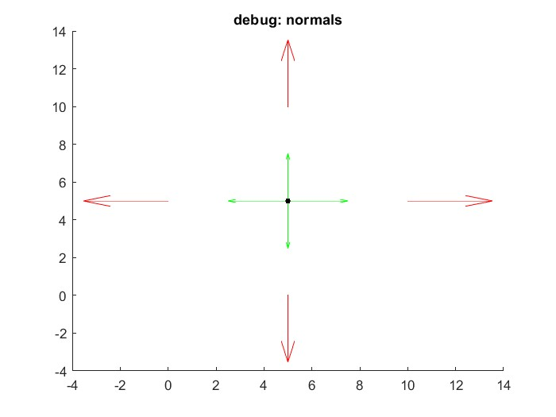
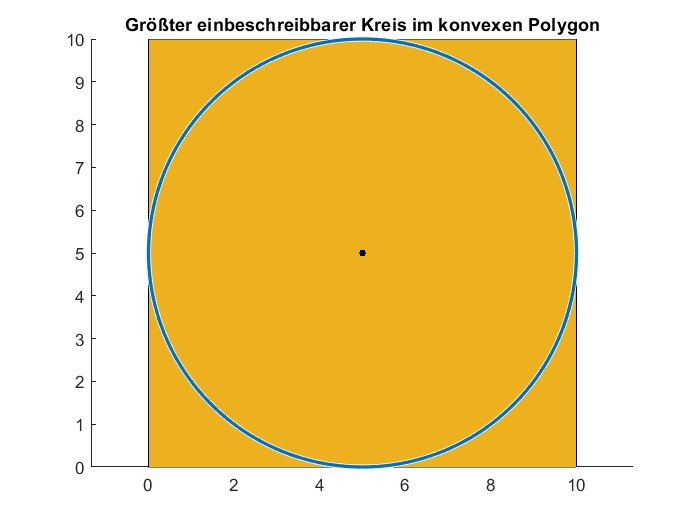
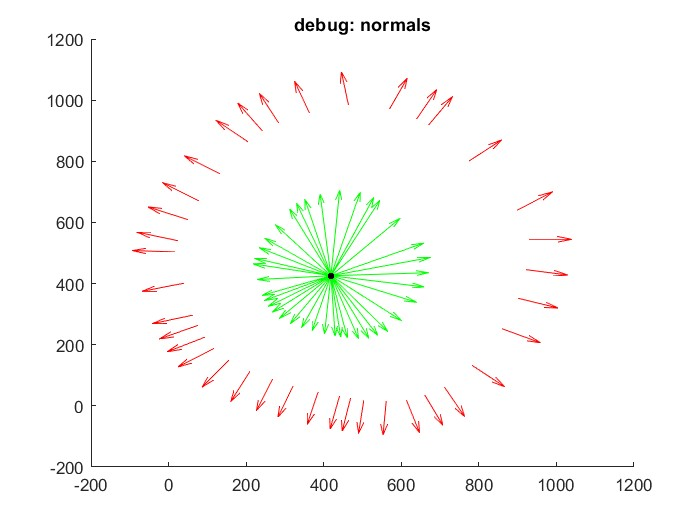
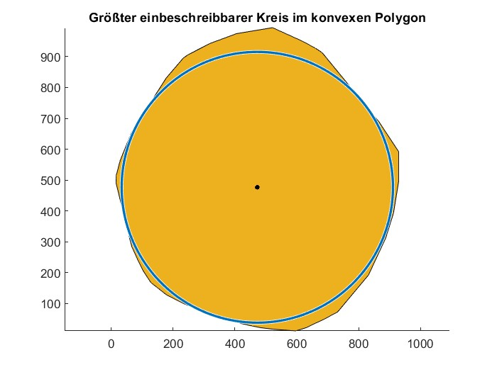

# Praktikum 5

## Aufgabenstellung
In der letzten Praktikumsaufgabe geht es um ein Optimierungsproblem, welches mittels Linear Programming definiert und gelöst werden soll. Ziel ist es, den größtmöglichen Kreis in einem vorgegebenen konvexen Polygon zu bestimmen, welcher innerhalb des Polygons liegt. Zum Lösen des Problems wurde Matlab verwendet.

## Linear Programming

Lineare Programmierung ist eine mathematische Methode zur Lösung von Optimierungsproblemen, bei denen das Ziel und die Einschränkungen durch lineare Gleichungen und Ungleichungen beschrieben werden. Die grundlegende Idee besteht darin, eine Zielfunktion zu definieren und die optimalen Werte der Variablen zu finden, die diese Zielfunktion maximieren oder minimieren, während alle Einschränkungen erfüllt werden. In unserem Bericht verwenden wir lineare Programmierung, um den größten möglichen Kreis innerhalb eines konvexen Polygons zu bestimmen. Dabei werden die Bedingungen für die Lage und Größe des Kreises durch lineare Ungleichungen beschrieben, die sicherstellen, dass der Kreis vollständig im Inneren des Polygons bleibt.

## lineare Ungleichungen

Die linearen Ungleichungen bestehen aus je einer Ungleichung pro Kante des Polygons. Nach der Formel für die Ungleichungen:

$$
Ax\geq b
$$

lässt sich $A$ und $b$ berechnen mit Hilfe des Normalenvektors.
Der normierte Normalenvektor $\vec{n_0}$ lässt sich für jede Kante $\overline{PQ}$ folgendermaßen berechnen:

$$
\vec{n} = \begin{bmatrix} q_y - p_y \\\\ p_x - q_x  \end{bmatrix}, \qquad
\vec{n_0} = \frac{\vec{n}}{\lvert{}\vec{n}\rvert{}}
$$

Per Definition ist die Kante der konvexen Hülle die maximale Grenze für den Radius des Kreises. Demnach lässt sich jede Ungleichung berechnen aus

$$
A = [\vec{n_0}^T, 1]
$$

und

$$
b = \vec{n_0}^T \cdot m_{PQ},   \qquad \text{mit} \quad
m_{PQ} = \begin{bmatrix} (p_x + q_x) / 2 \\\\ (p_y + q_y) / 2 \end{bmatrix}
$$

Hierbei beschreibt $m_{PQ}$ der Mittelpunkt der Geraden zwischen dem Punkt P und Q.

## Zielfunktion

Ziel ist es, den Mittelpunkt des Kreises nach den Nebenbedingungen so zu wählen, dass der Radius r maximal wird. Da in Matlab standardmäßig minimiert wird, muss das Vorzeichen umgedreht werden.

$$
f = [0, 0, -1]
$$

Die ersten beiden Einträge stehen für die x- und y-Komponente des Kreismittelpunkts.

## Implementierung
- Programmiersprache: Matlab (R2024a)

### Pseudo Code
1. Polygon einlesen
2. Debugging: Daten der Polygone angleichen 
   - letzter Eintrag (Vertex) entfernen, wenn "letzter = erster"
   - Normalenvektoren drehen, sofern sie nicht nach Außen zeigen
   - Überprüfung auf Konvexität
3. lineare Ungleichungen aufstellen für jede Kante
   - $\vec{n} \cdot M_{circle} -r \geq 0$
4. Zielfunktion definieren: maximieren auf Radius des Kreises (bei Matlab: minimieren, daher -1)
   - $f=[0,0,-1]$
5. Lineares Programm lösen und plotten

## Ergebnis

Zur Auswahl steht ein simples Quadrat als Testpolygon und ein weiteres deutlich komplexeres Polygon. Beide Ergebnisse sind in diesem Abschnitt dargestellt.\
Als Ergbnis des Linear Programming erhält man einen Vektor x zurück, welcher die x- und y-Komponente des Kreismittelpunkts beinhaltet, den Wert fval, welcher die zu optimierende Größe Radius $r$ ist und eine exitflag, welche verschiedene Errorflags als Feedback zurückliefern kann, oder den Wert 1, wenn die Funktion zu einer Lösung konvergiert ist.

### Testpolygon

Die Berechnung der Normalenvektoren (rot) der Kanten des Polygons ergibt nach Außen zeigende Vektoren. Die grünen Vektoren $v_{dir}$ sind Hilfsvektoren, welche in die Richtung der Kantenmitte vom Polygonzentrum aus zeigen. Über das Skalarprodukt aus 
$$
s = \vec{n_0}^T \cdot v_{dir}
$$

lässt sich mit den Hilfsvektoren erkennen, ob der Normalenvektor nach Außen ( $s>0$ ) oder nach Innen ( $s<0$ ) zeigt und so, wenn nötig, umgedreht werden muss. Dieser Test ist nötig, da die beiden Polygone unterschiedlich aufgebaut sind und andernfalls nicht richtig berechnet werden.

   

Als Ergebnis des Linear Programming erhält man dann einen Kreis, welcher den Mittelpunkt bei

$$
M_{circle} = \begin{bmatrix} 5,0 \\\\ 5,0\end{bmatrix}
$$

und einen Radius von $ r = 5,0 $ besitzt.

   

### Polygon

Derselbe Kantentest der Polygone wird nun mit dem zweiten, komplexeren konvexen Polygon durchgeführt. Auch hier lässt sich erkennen, wie nach der Korrektur sämtliche Normalenvektoren (rot) nach Außen zeigen und damit in dieselbe Halbebenenrichtung wie ihre zugehörigen Hilfsvektoren (grün).

   

Nach Durchführen des Linear Programming Algorithmus' erhält man einen Kreis, welcher vollständig innerhalb der konvexen Hülle liegt mit dem Zentrum des Kreises bei

$$
M_{circle} = \begin{bmatrix} 472,57 \\\\ 476,66 \end{bmatrix}
$$

und einen Radius von $ r = 438,59 $ besitzt.

   

